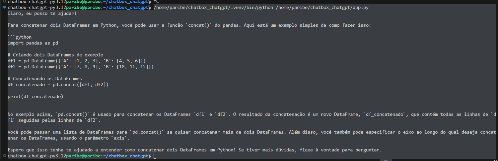
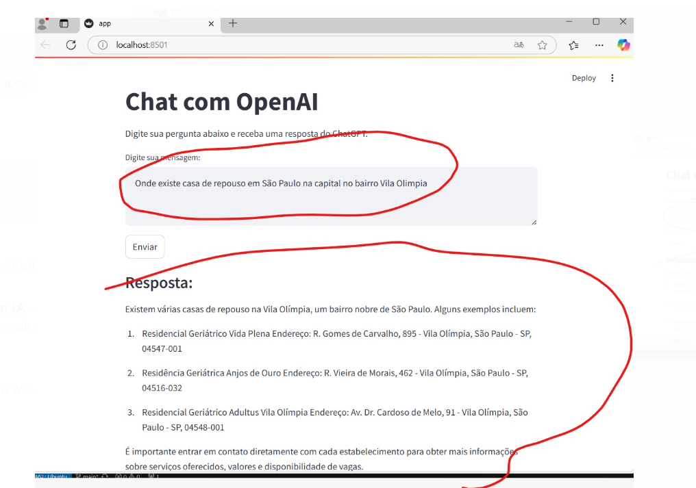

# Chatbox com OpenAI GPT

Este projeto permite enviar mensagens para a API da OpenAI e receber respostas do modelo de linguagem **GPT-3.5 Turbo**. Ele pode ser usado como um chatbot para obter respostas automáticas baseadas em IA.

## 📌 Requisitos
Antes de executar o projeto, certifique-se de ter os seguintes requisitos instalados:

- Python 3.12+
- [Poetry](https://python-poetry.org/docs/) (para gerenciar dependências)
- Uma chave de API válida da OpenAI ([Obtenha a sua aqui](https://platform.openai.com/api-keys))

## 🚀 Instalação
1. Criar a pasta:
   ```sh
   mkdir chatbox-chatgpt
   cd chatbox-chatgpt
   ```
2. Instale as dependências do projeto com Poetry:
   ```sh
   poetry install
   ```
3. Crie um arquivo `.env` para armazenar sua chave de API:
   ```sh
   echo "OPENAI_API_KEY=sua_chave_aqui" > .env
   ```

## 🔥 Como Usar
1. Ative o ambiente virtual:
   ```sh
   poetry shell
   ```
2. Execute o script principal:
   ```sh
   python app.py
   ```

O programa enviará uma mensagem à API da OpenAI e imprimirá a resposta no console.

## 📝 Exemplo de Código
```python
import openai
import os
from dotenv import load_dotenv

load_dotenv()
chave_api = os.getenv("OPENAI_API_KEY")

client = openai.OpenAI(api_key=chave_api)

def enviar_mensagem(mensagem):
    resposta = client.chat.completions.create(
        model="gpt-3.5-turbo",
        messages=[{"role": "user", "content": mensagem}]
    )
    return resposta.choices[0].message.content

print(enviar_mensagem("Como concatenar dois DataFrames no Python?"))
```

## 🛠 Tecnologias Usadas
- Python 3.12
- OpenAI API
- Poetry (Gerenciamento de dependências)

## 📌 Possíveis Erros e Soluções
### 1. **`openai.AuthenticationError: Error code: 401`**
   **Solução:** Verifique se a chave de API é válida e se está configurada corretamente no `.env`.

### 2. **`openai.RateLimitError: Error code: 429`**
   **Solução:** Você pode ter atingido o limite gratuito da API. Aguarde um tempo ou faça upgrade para um plano pago.


Evidência da execução:






